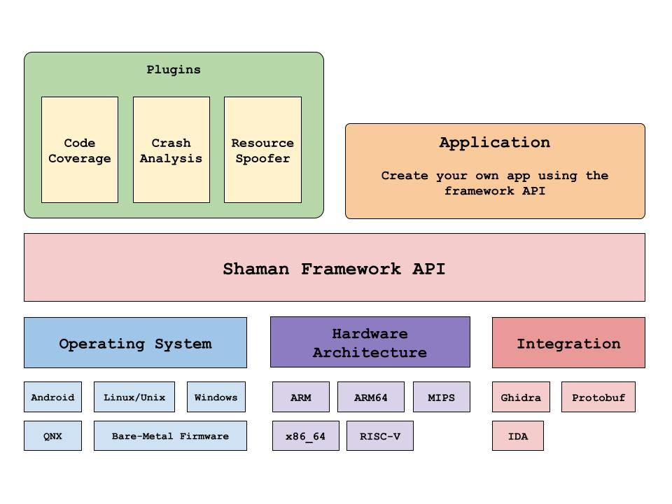

# What is Shaman?

Shaman is a architecture neutral Dynamic Binary Analysis Framework which can be used to instrumentation program without recompiling or source code. Shaman is currently working on Linux(x86_64, ARM, ARM64) and Android (ARM64).

Shaman is simply a high-performance debugger which can halt a running program at any point and inspect/modify its memory/register values. This capability can be used to do various things like tracing and modifying program System Calls, Injecting System calls, gathering binary code-coverage and intercepting/modifying function parameters.

The goal of this tool is to make it easy to write plugins and porting to newer platform like RISC-V, Power PC, etc should be as easy/quickly as possible.

# Why ?

There are other instrumentation tools in the market like DynamoRIO, Intel Pintool and Frida which do fulblown instrumentaition and there are some other tools like TinyInst and mesos which do the selective instrumentation. This framework leans more towards selective intrumentation with more exposed internal interface and easy to port interface with some additional unique features like Syscall injection, Resource Tracing and Code-coverage streaming.

This framework will focus 
Since this tool is currently based on ptrace Support older verion of Linux

# Features

## Code Coverage

## Resource Tracing

## Syscall Injection

## Syscall Tracing

# Instrumentation API

# Building Shaman

# Quick Usage Guide

# Usage

# Platform Support

| Platform | x86_64 | ARM | ARM64 |
|---|---|---|---|
| Linux x86_64 | Yes | Yes |Yes |
| Android ARM64 | No | No |Yes |
| Micro-controller | No | No | No |

# Limitations

- Ghidra Dep
- Multi-threaded coverage

# Coverage File Format

